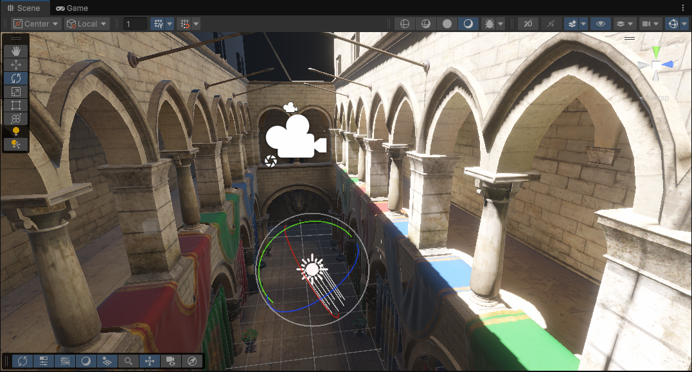
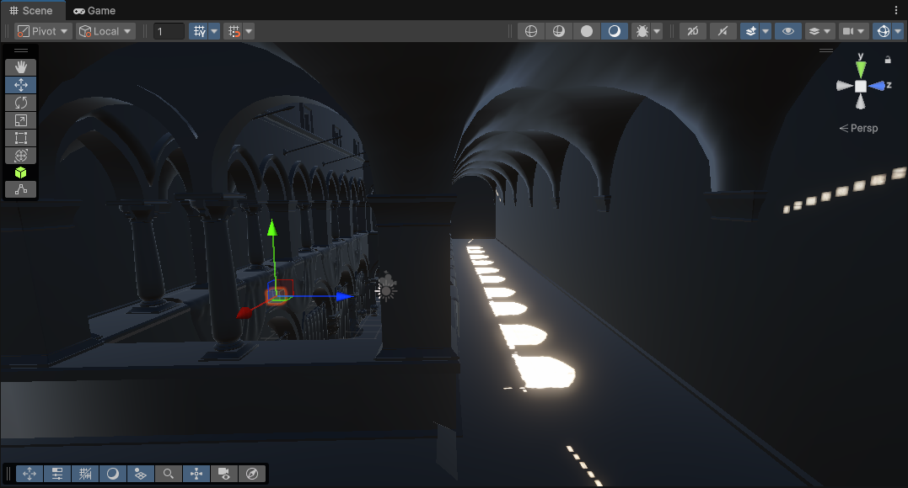
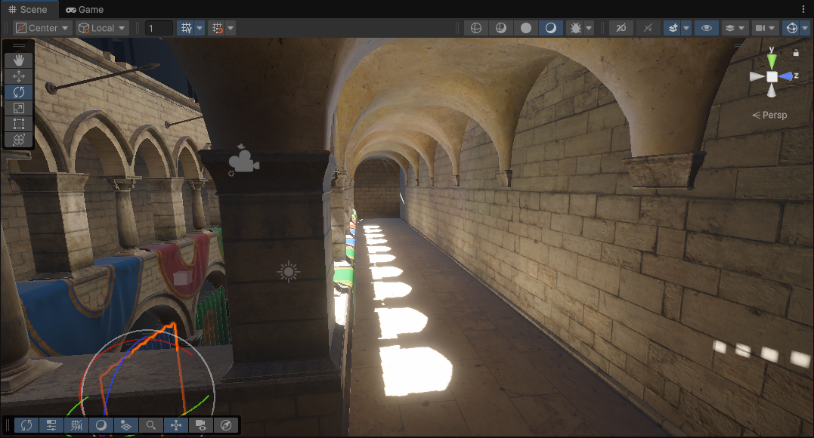

# Dou GI: Radiance Field

一个基于 Unity URP 的实验性 Probe Global Illumination 项目。

项目通过 Radiance Probe 捕获场景表面样本，在 Compute Shader 中更新样本辐射度并投影为 SH9 系数，最后在屏幕空间重建 Radiance Field，为场景叠加间接光照。

## 设计特点

- 使用 `Dou.GI` 命名空间组织运行时代码。
- 将静态表面采样和动态光照更新分离，避免每帧重新捕获 Cubemap。
- 通过 `RadianceFieldRegistry` 管理活动 Volume，渲染阶段不再全场景搜索 Probe。
- 使用当前帧/历史帧 SH 双缓冲支持多次间接光反馈。
- C# 与 Shader 共享统一的 `_RF_*` 参数命名。

## 运行效果

### 开启 Probe GI

### 间接光对比

| 未开启 Probe GI | 开启 Probe GI |
| --- | --- |
|  |  |

开启 Probe GI 后，拱廊中的墙面、立柱和顶部暗部能够接收到由 Probe 重建的间接光照，减少完全发黑的区域。

## 核心流程

1. `RadianceFieldVolume` 创建 Probe 网格并管理当前帧与历史帧系数。
2. `RadianceProbe` 使用临时相机捕获 Albedo、Normal 和 World Position。
3. `CaptureSurfaceSamples.compute` 从 Cubemap 中构建方向均匀的表面样本。
4. `IntegrateProbeRadiance.compute` 更新样本辐射度并投影到 SH9。
5. `RadianceFieldUpdateFeature` 驱动所有活动 Volume 的逐帧更新。
6. `RadianceFieldSH.hlsl` 插值相邻 Probe 并重建间接光。
7. `RadianceFieldComposite.shader` 将 Radiance Field 合成到相机颜色结果中。

## 光照参数

- `Environment Intensity`：控制天空环境光写入 Probe 的强度。
- `Bounce Intensity`：控制上一帧间接光反馈到下一帧的强度。
- `Output Intensity`：控制 Radiance Field 合成到最终画面时的显示强度。

## 说明

这是一个用于学习和验证 Probe GI 流程的实验项目，目前仍包含部分 URP Compatibility Mode API。间接光效果会受到 Probe 数量、间距、场景尺度、天空光强度和间接光强度等参数影响。
